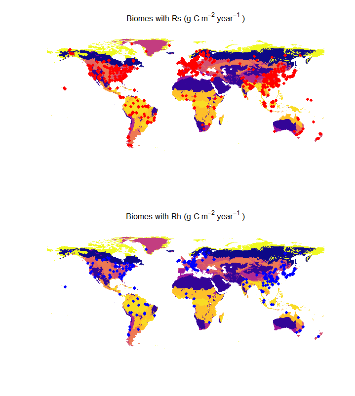
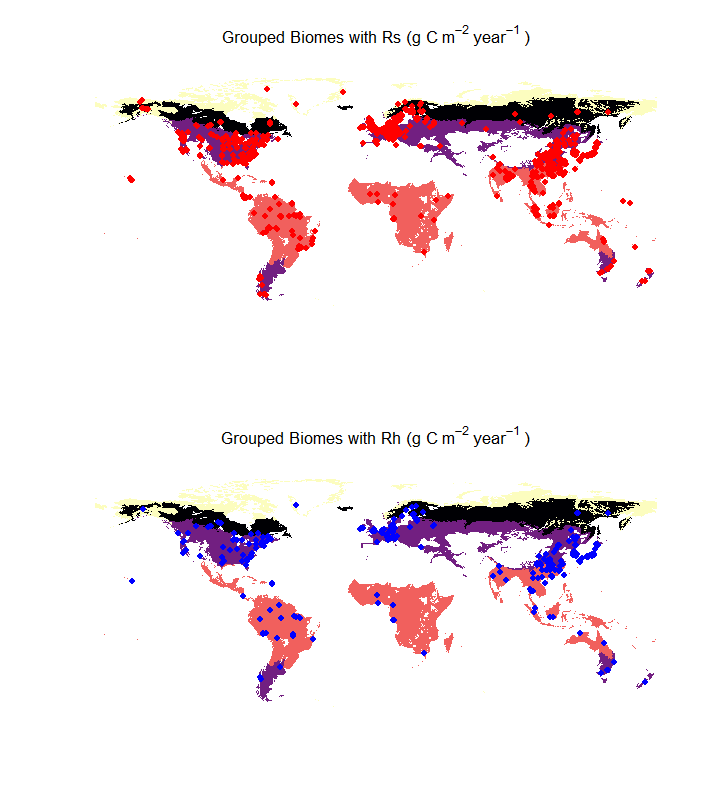

``` r
# Load all required packages
library(terra)
#> terra 1.8.21
library(dplyr)
#> 
#> Anexando pacote: 'dplyr'
#> Os seguintes objetos são mascarados por 'package:terra':
#> 
#>     intersect, union
#> Os seguintes objetos são mascarados por 'package:stats':
#> 
#>     filter, lag
#> Os seguintes objetos são mascarados por 'package:base':
#> 
#>     intersect, setdiff, setequal, union
library(tmap)
library(tmaptools)
library(geobr)
library(sf)
#> Linking to GEOS 3.12.2, GDAL 3.9.3, PROJ 9.4.1; sf_use_s2() is TRUE
library(mapview)
library(ggplot2)
library(readxl)
library(leafem)
library(leaflet)
library(htmltools)
library(viridis)
#> Carregando pacotes exigidos: viridisLite

# Environment setup
rm(list = ls())
gc()

sf_use_s2(FALSE)
#> Spherical geometry (s2) switched off

# Projection definition
igh <- "+proj=igh +lat_0=0 +lon_0=0 +datum=WGS84 +units=m +no_defs"

# Load and process biome data
biome <- st_read("./vect/biome.shp") %>% 
  st_transform(4326) %>% 
  st_make_valid()
#> Reading layer `biome' from data source 
#>   using driver `ESRI Shapefile'
#> Simple feature collection with 16 features and 1 field
#> Geometry type: MULTIPOLYGON
#> Dimension:     XY
#> Bounding box:  xmin: -19398430 ymin: -6395608 xmax: 19857580 ymax: 8415536
#> Projected CRS: +proj=igh +lon_0=0 +x_0=0 +y_0=0 +datum=WGS84 +units=m +no_defs

# Create biome groups with detailed recode
biome_g <- biome %>%
  mutate(biome_g = recode(
    biome,
    `Boreal Forests/Taiga` = "Boreal",
    `Tundra` = "Tundra",
    `Temperate Conifer Forests` = "Temperate",
    `Temperate Broadleaf & Mixed Forests` = "Temperate",
    `Temperate Grasslands, Savannas & Shrublands` = "Temperate",
    `Tropical & Subtropical Coniferous Forests` = "Tropical",
    `Tropical & Subtropical Dry Broadleaf Forests` = "Tropical",
    `Tropical & Subtropical Grasslands, Savannas & Shrublands` = "Tropical",
    `Tropical & Subtropical Moist Broadleaf Forests` = "Tropical",
    .default = NA_character_
  )) %>%
  group_by(biome_g) %>%
  summarize() %>%
  na.omit() %>%
  st_make_valid()
#> although coordinates are longitude/latitude, st_union assumes that they are
#> planar

# Load and process respiration data
resp_files <- list.files(
  path = "./vect",
  pattern = "rh.shp|rs.shp",
  full.names = TRUE
)

vars_y_sf_biome <- lapply(resp_files, function(f) {
  st_read(f) %>%
    st_transform(4326) %>%
    st_intersection(biome) %>%
    st_make_valid()
})
#> Reading layer `rh' from data source 
#>   using driver `ESRI Shapefile'
#> Simple feature collection with 849 features and 1 field
#> Geometry type: POINT
#> Dimension:     XY
#> Bounding box:  xmin: -156.67 ymin: -42.87 xmax: 172.75 ymax: 71.52
#> Geodetic CRS:  WGS 84
#> although coordinates are longitude/latitude, st_intersection assumes that they
#> are planar
#> Warning: attribute variables are assumed to be spatially constant throughout
#> all geometries
#> Reading layer `rs' from data source 
#>   using driver `ESRI Shapefile'
#> Simple feature collection with 3329 features and 3 fields
#> Geometry type: POINT
#> Dimension:     XY
#> Bounding box:  xmin: -156.67 ymin: -51.81 xmax: 175.5 ymax: 78
#> Geodetic CRS:  WGS 84
#> although coordinates are longitude/latitude, st_intersection assumes that they
#> are planar
#> Warning: attribute variables are assumed to be spatially constant throughout
#> all geometries

vars_y_sf_biome_g <- lapply(resp_files, function(f) {
  st_read(f) %>%
    st_transform(4326) %>%
    st_intersection(biome_g) %>%
    st_make_valid()
})
#> Reading layer `rh' from data source 
#>   using driver `ESRI Shapefile'
#> Simple feature collection with 849 features and 1 field
#> Geometry type: POINT
#> Dimension:     XY
#> Bounding box:  xmin: -156.67 ymin: -42.87 xmax: 172.75 ymax: 71.52
#> Geodetic CRS:  WGS 84
#> although coordinates are longitude/latitude, st_intersection assumes that they
#> are planar
#> Warning: attribute variables are assumed to be spatially constant throughout
#> all geometries
#> Reading layer `rs' from data source 
#>   using driver `ESRI Shapefile'
#> Simple feature collection with 3329 features and 3 fields
#> Geometry type: POINT
#> Dimension:     XY
#> Bounding box:  xmin: -156.67 ymin: -51.81 xmax: 175.5 ymax: 78
#> Geodetic CRS:  WGS 84
#> although coordinates are longitude/latitude, st_intersection assumes that they
#> are planar
#> Warning: attribute variables are assumed to be spatially constant throughout
#> all geometries

# Visualization parameters
color_biome <- viridis(n_distinct(biome$biome), option = "plasma")
color_biome_g <- viridis(n_distinct(biome_g$biome_g), option = "magma")

# Static plots for original biomes
par(mfrow = c(2,1))
plot(st_geometry(biome), 
     col = color_biome[as.factor(biome$biome)],
     main = expression("Biomes with Rs (g C"~m^{-2}~year^{-1}~")"),
     border = NA)
plot(st_geometry(vars_y_sf_biome[[2]]), add = TRUE, pch = 19, col = "#FF0000", cex = 1)

plot(st_geometry(biome), 
     col = color_biome[as.factor(biome$biome)],
     main = expression("Biomes with Rh (g C"~m^{-2}~year^{-1}~")"),
     border = NA)
plot(st_geometry(vars_y_sf_biome[[1]]), add = TRUE, pch = 19, col = "#0000FF", cex = 1)
```

<p align="center">

</p>

``` r

# Static plots for grouped biomes
par(mfrow = c(2,1))
plot(st_geometry(biome_g), 
     col = color_biome_g[as.factor(biome_g$biome_g)],
     main = expression("Grouped Biomes with Rs (g C"~m^{-2}~year^{-1}~")"),
     border = NA)
plot(st_geometry(vars_y_sf_biome_g[[2]]), add = TRUE, pch = 19, col = "#FF0000", cex = 1)

plot(st_geometry(biome_g), 
     col = color_biome_g[as.factor(biome_g$biome_g)],
     main = expression("Grouped Biomes with Rh (g C"~m^{-2}~year^{-1}~")"),
     border = NA)
plot(st_geometry(vars_y_sf_biome_g[[1]]), add = TRUE, pch = 19, col = "#0000FF", cex = 1)
```

<p align="center">

</p>
